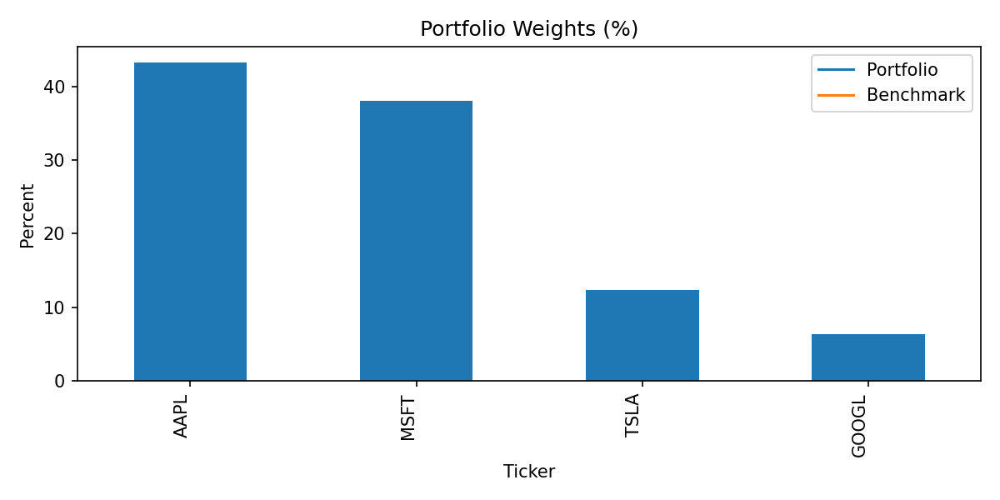

# Finance Portfolio Tracker

Interactive Streamlit app with Beginner & Advanced views. Uses free yfinance data.

[](https://finance-portfolio-tracker.streamlit.app/)
[](https://github.com/FlawlessDem0n/finance-portfolio-tracker/actions/workflows/ci.yml)
[](LICENSE)

## Screenshots
<p align="center">
  
  
</p>

If you prefer, you can also view the UI screenshots:
<p align="center">
  <br/>
  <br/>
  
</p>

## Quickstart
```bash
pip install -r requirements.txt
streamlit run app.py
```

## Beginner Mode
- Portfolio Health Score (diversification, ups & downs, market sensitivity)
- Donut charts (holdings and sectors)
- 1-day winners/losers table
- Goals and "what-if I invest more" slider
- Plain-English explanations of risk metrics

## Advanced Mode
- Return per unit of risk (Sharpe)
- Moves vs market (Beta)
- Annualized return and volatility
- Max drawdown
- Cumulative performance vs benchmark

## Example Inputs
Copy & paste into the app sidebar:
- AAPL:50, MSFT:30, AMZN:10, GOOGL:15, TSLA:5
- NVDA:10, JPM:25, JNJ:15, XOM:20, WMT:30
- KO:40, PEP:30, MCD:10, JNJ:10, PG:10

## Project Structure
finance-portfolio-tracker/
- app.py                 (Streamlit app: Beginner + Advanced)
- portfolio_tracker.py   (CLI script: prints stats, saves charts)
- requirements.txt       (Dependencies)
- README.md              (This document)
- LICENSE                (MIT)
- docs/                  (Screenshots)
- examples/              (Sample portfolio inputs)

## Tech Stack
- Streamlit — interactive dashboards
- yfinance — free financial data
- pandas and numpy — data wrangling
- matplotlib — charts

## License
MIT — see LICENSE.

## Contributing
Pull requests welcome. Please open an issue first for discussion. For major changes,
fork the repo and create a feature branch.
